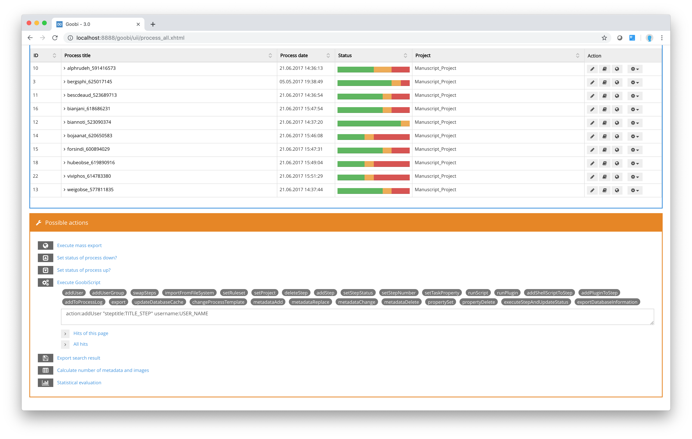
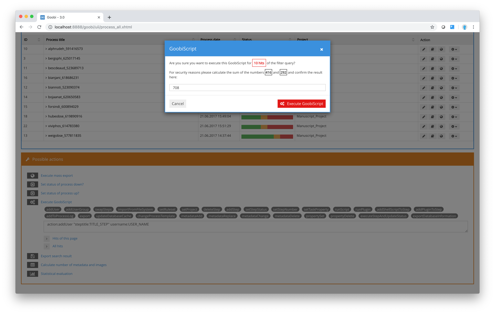

# 7.4. GoobiScript

When you apply an action to a group of processes, you also have an option to run Goobi scripts within that action. To do so, click on the button `Execute GoobiScript` in the `Possible actions` box. Goobi will display an overview of all the scripts that can be applied to the entire list of processes, to the processes listed on the current page or just to a selection of processes.

For every GoobiScript, you need to enter the name of the script you wish to run as well as the corresponding parameters. These parameters are shown when you click on the script in the list. You will need to replace the parameters in capital letters with your own settings. Please note that parameters containing spaces \(e.g. the name of a step\) must be written inside quotation marks.



After completing the GoobiScript, you can now apply it to selected hits or the entire hit list. Before execution, however, a confirmation prompt appears in which an addition task must first be answered in order to prevent an accidental call.



You can choose from the following Goobi scripts:

## GoobiScript: addUser

The GoobiScript `addUser` allows you to add a new user to a specific workflow step. Before you apply this Goobi script, you should ensure that you have the correct login name for the user you wish to add to that step. You also need to check the exact name of the step to which you want to add a new user.

Please note that parameters containing spaces must be written inside quotation marks together with the parameter name and the dividing colon. For the parameter `steptitle` you should select the name of the step to which you want to add the new user.

## GoobiScript: addUserGroup

The GoobiScript `addUserGroup` is similar to `addUser`, as it gives additional user rights for workflow steps. For the parameter `steptitle`, enter the full name of the step to which you want to add a `user group`, and for the parameter entitled group enter the exact name of the user group you wish to add for that step.  
.

## GoobiScript: deleteTiffHeaderFile

For the GoobiScript `deleteTiffHeaderFile` there is no need to enter additional parameters. Running this GoobiScript will delete any previously created TIFF header files that can be used by a program that writes the TIFF headers into the images. This allows you, for example, to make centrally modified TIFF headers available for future use, since missing TIFF header files are automatically created on the basis of the configuration the next time the file is accessed.

## GoobiScript: swapSteps

The GoobiScript `swapSteps` allows you to swap the order of two steps within the workflow of a number of processes. To perform a swap, you need to provide the details of each of the steps involved. Enter the workflow number and full name of the first and second step. Running this script will then swap the order of the steps you have specified. This makes it very easy to change workflows across a large number of processes.

## GoobiScript: importFromFileSystem

The GoobiScript `importFromFileSystem` imports existing image sets from a defined output directory into processes that have already been created in Goobi. This can be useful if you want to import projects into Goobi that were created before Goobi was installed. Please note that all the image directories within the specified output directory must have the same name as the processes in Goobi. An automatic import from the file system can only be performed correctly if the folder name and process title are identical. For the parameter entitled `sourcefolder`, you need to specify the location of the individual directories containing the processes you wish to import.  
.

## GoobiScript: setRuleset

The GoobiScript `setRuleset` allows you to make a central change to the Goobi ruleset for a group of processes. This could be particularly important after detailed editing and testing of a ruleset \(for safety reasons this is performed separately in a newly created ruleset\), if you then wish to apply the new ruleset to the processes. For the parameter entitled `ruleset`, you need to specify the name of the ruleset using the name as it appears in the ruleset list in Goobi. The newly assigned ruleset will be entered when you run the GoobiScript, regardless of which ruleset is currently in place for the individual processes being changed.

## GoobiScript: deleteStep

You can run the GoobiScript `deleteStep` if you want to delete a specific step from the workflow for a group of processes. Running the script will delete the workflow step \(specified by its full name in the parameter `steptitle`\) from the list of selected processes. Please note that this GoobiScript will also delete any production-related data being stored for that particular workflow step \(e.g. project staff, processing date, status\).

## GoobiScript: addStep

The GoobiScript entitled `addStep` allows you to automatically create a new step with a specific name and a specific position in the workflow order. For the parameter `steptitle`, enter the name of the new step, and for the parameter `number` enter the required workflow order number.

## GoobiScript: setStepStatus

You can choose the GoobiScript `setStepStatus` to modify the workflow status for a group of processes at the same time. For the parameter `steptitle`, you need to enter the name of the workflow step whose status you wish to change. For the status `parameter`, you should enter the required numerical value using the system:

```text
0=locked
1=open
2=in progress
3=closed
4=error
5=deactivated
```

## GoobiScript: setStepNumber

Using the GoobiScript `setStepNumber` you can modify the workflow order number of an individual step for a group of processes. For the parameter `steptitle` you need to enter the full name of the workflow step you wish to change. For the `number` parameter you should enter the workflow order number you want to apply to that step for all the selected processes.

## GoobiScript: addShellScriptToStep

The GoobiScript `addShellScriptToStep` allows you to add shell scripts or other command-line calls to designated workflow steps in a group of processes. For the parameter `steptitle` you need to specify the full name of the steps you wish to change. For the `script` parameter, enter the full command that you wish Goobi to execute in the form of a command-line call whenever this step is activated.

Please note that shell commands at Linux level begin with `/bin/bash/`.


If parameters are to be grouped in the command so that they are passed as an argument to the new process, the necessary quotation marks must be escaped with one preceding quotation mark each. An example would be the following GoobiScript:  
  
`action:addShellScriptToStep "steptitle:example_step" "label:testlabel" "script:/bin/bash /path/to/script.sh ""parameter with blanks"""`


## GoobiScript: setTaskProperty

You can use the Goobi script setTaskProperty to set individual options for a specific workflow step in a group of processes at the same time. For the parameter steptitle, you should enter the full name of the step you wish to select. For the propertyparameter, you will need to select one of the following values:

<table>
  <thead>
    <tr>
      <th style="text-align:left"><b>Parameter</b>
      </th>
      <th style="text-align:left">Description</th>
    </tr>
  </thead>
  <tbody>
    <tr>
      <td style="text-align:left"><b>metadata</b>
      </td>
      <td style="text-align:left">to modify the metadata property.</td>
    </tr>
    <tr>
      <td style="text-align:left"><b>readimages</b>
      </td>
      <td style="text-align:left">to modify the property that determines whether the user is given read-only
        access to the image.</td>
    </tr>
    <tr>
      <td style="text-align:left"><b>writeimages</b>
      </td>
      <td style="text-align:left">for the property that determines whether the user is given write access
        to the image.</td>
    </tr>
    <tr>
      <td style="text-align:left"><b>validate</b>
      </td>
      <td style="text-align:left">for the property that determines whether validation is required once a
        step is completed.</td>
    </tr>
    <tr>
      <td style="text-align:left"><b>exportdms</b>
      </td>
      <td style="text-align:left">for the property that determines whether the step should be able to perform
        an export to the presentation system.</td>
    </tr>
    <tr>
      <td style="text-align:left"><b>batch</b>
      </td>
      <td style="text-align:left">for the property as to whether the step is to be executed together with
        all other steps in batch mode.</td>
    </tr>
    <tr>
      <td style="text-align:left"><b>automatic</b>
      </td>
      <td style="text-align:left">for the property as to whether the step is to be executed automatically.</td>
    </tr>
    <tr>
      <td style="text-align:left"><b>importfileupload</b>
      </td>
      <td style="text-align:left">
        <p>for the property as to whether a file upload is to be used for data import
          in this step.</p>
        <p>(Please note that this function is no longer used in Goobi.)</p>
      </td>
    </tr>
    <tr>
      <td style="text-align:left"><b>acceptandclose</b>
      </td>
      <td style="text-align:left">for the property as to whether the step is to be accepted directly without
        action and closed again.</td>
    </tr>
    <tr>
      <td style="text-align:left"><b>acceptmoduleandclose</b>
      </td>
      <td style="text-align:left">
        <p>for the property of whether a module is to accept and execute a step and
          whether the step is to be completed immediately.</p>
        <p>(Please note that this function is no longer used in Goobi.)</p>
      </td>
    </tr>
    <tr>
      <td style="text-align:left"><b>script</b>
      </td>
      <td style="text-align:left">for the property as to whether the step is to execute a script.</td>
    </tr>
    <tr>
      <td style="text-align:left"><b>delay</b>
      </td>
      <td style="text-align:left">for the property whether this step is a delay step that is to wait a configured
        amount of time.</td>
    </tr>
    <tr>
      <td style="text-align:left"><b>updatemetadataindex</b>
      </td>
      <td style="text-align:left">for the property that the internal database index is to be updated in
        this step.</td>
    </tr>
    <tr>
      <td style="text-align:left"><b>generatedocket</b>
      </td>
      <td style="text-align:left">for the property as to whether the user shall be able to download a docket
        in this step.</td>
    </tr>
  </tbody>
</table>

You should also set the value of the actions you have specified here to activated or deactivated by entering the values `true` or `false` for the value parameter..


**Sample:** For example, if you select `Scanning` as the `steptitle`, `writeimages` as the `property` and `true` as the `value` and apply this GoobiScript to a group of processes, this will allow a user who accepts the step entitled `Scanning` to have write access to the images in his/her working directory for that step.


## GoobiScript: export

The GoobiScript `export` allows you to export a large number of processes. The parameters `exportImages` and `exportOcr` can be used to specify whether the associated images and OCR data should be exported. If an export plugin has been configured in the workflow, that plugin will be loaded and used for the export; if not, Goobi will run the default export.

## GoobiScript: runScript

Using the GoobiScript `runScript`, you can initiate a script for a particular workflow step outside the regular workflow. The parameter `steptitle` is used to enter the full title of the workflow step whose scripts you wish to run.

If the workflow step contains a number of scripts, you can specify which one you wish to run using the `script` parameter. If this parameter is left blank, all the scripts for that workflow step will be run in the specified sequence.

## GoobiScript: deleteProcess

As the name suggests, the GoobiScript `deleteProcess` is used to delete processes. You have to use the parameter `contentOnly` \(value `true` or `false`\) to specify whether Goobi should delete only the data from the file system or, additionally, all the information from the database. If this parameter is left blank, the process will be deleted completely.

## GoobiScript: addPluginToStep

The GoobiScript `addPluginToStep` allows you to add plugins to workflow steps. You can use the parameter `steptitle` to specify the name of the workflow step and the parameter `plugin` for the identifier of the plugin that you wish to add.

## GoobiScript: updateImagePath

The GoobiScript `updateImagePath` updates the path to the image files within the METS files. No parameters are required to run this GoobiScript.

## GoobiScript: updateContentFiles

The GoobiScript `updateContentFiles` updates the list of all image files within the METS files. No parameters are required to run this GoobiScript.

## GoobiScript: addToProcessLog

The GoobiScript `addToProcessLog` allows adding messages to the process log. The `type` parameter determines how the message should be classified. The `message` parameter specifies the content of the message.

| Possible types | Description |
| :--- | :--- |
| debug | Internal system messages, primarily for administrators |
| info | Information messages that every user should be able to see |
| warn | Warning messages that every user should see |
| error | Error messages that every user should see |
| user | User comments that users enter visibly for all other users  |

## GoobiScript: setProject

The GoobiScript `setProject` allows you to assign the selected tasks to a defined project. The parameter `project` specifies which project should be used for this.

## GoobiScript: runPlugin 

The GoobiScript `runPlugin` allows the execution of a step plugin for the selected tasks. The parameter `steptitle` determines the step of the affected tasks from which the plugin is to be executed. 

## GoobiScript: import 

The GoobiScript `import` is not intended for execution by users from the user interface. Instead, it is started during the execution of mass imports from the selected plugin. It then performs a mass import in the form specified in the import plug-in. The parameter `plugin` defines the unique name of the plugin. The `identifiers` parameter determines which identifiers the data records have that are to be imported. The parameter `template` determines which production template is to be used for the import. 

## GoobiScript: metadataDelete 

The GoobiScript `metadataDelete` allows you to delete metadata from a process. The `field` parameter specifies the type of metadata, where the internal rule set name must be used. The `value` parameter defines the content of the metadata. The `position` parameter allows you to specify whether the metadata should be at the top level \(`top`\) or at the position of the first child \(`child`\). The parameter `ignoreValue` determines whether the content of the parameter value is to be ignored and whether the metadata is to be deleted independently of its value.


**Sample calls:**

Delete a metadata entry on top level:

`action:metadataDelete field:DocLanguage value:deutsch position:child`

Delete a metadata entry on top level, but the current value should be ignored

`action:metadataDelete field:DocLanguage value:deutsch position:top ignoreValue:true`


## GoobiScript: metadataAdd

The GoobiScript `metadataAdd` allows you to add new metadata to a process. The `field` parameter defines the type of metadata, where the internal ruleset name must be used. The `value` parameter defines what content the new metadata should contain. The `position` parameter allows you to specify whether the metadata is to be entered at the top level \(`top`\) or at the second level \(`child`\).


**Sample calls:**

Adding a metadata entry on top level:

`action:metadataAdd field:DocLanguage value:deutschTop position:top`

Adding a metadata entry on second level:

`action:metadataAdd field:DocLanguage value:deutschChild position:child`


## GoobiScript: metadataReplace

The GoobiScript `metadataReplace` allows you to replace a metadata with a new value. The old value is thus replaced by another value and is therefore no longer available. The `field` parameter determines which type the metadata has, whereby the internal ruleset name must be used here. The `search` parameter defines the current content of the metadata. The `replace` parameter defines which content the metadata is to have instead. The `position` parameter allows you to specify whether the metadata should be on the top level \(`top`\) or on the second level \(`child`\).


**Sample calls:**

Search for a value within a certain top-level metadata and replace it with something else:

`action:metadataReplace field:DocLanguage search:deutschTop replace:deutschNewTop position:top`

Find a value within a certain second level metadata and replace it with something else:

`action:metadataReplace field:DocLanguage search:deutschChild replace:deutschNewChild position:child`


## GoobiScript: metadataChangeValue

The GoobiScript `metadataChangeValue` allows the manipulation of existing metadata of a process. Prefixes or suffixes can be added to an existing metadata to extend the content of a metadata. The `field` parameter specifies the type of metadata, where the internal ruleset name must be used. The content of the `prefix` parameter is used to prefix a text with the current value of the metadata. The content of the parameter `suffix` is used to append a text after the current value of the metadata. The `position` parameter allows you to specify whether the metadata should be on the top level \(`top`\), for a volume on the second level \(`child`\) or for a publication \(`work`\).


**Sample calls:**

Add a prefix to a top-level metadata::

`action:metadataChangeValue field:DocLanguage prefix:start_ suffix:_end position:top`

Add a suffix to a top-level metadata, but there must be a specific value in the metadata:

`action:metadataChangeValue field:DocLanguage "suffix: ist eine schwierige Sprache" position:top condition:Deutsch`

Add a prefix and suffix to a second-level metadata:

`action:metadataChangeValue field:DocLanguage prefix:start_ suffix:_end position:child`


## GoobiScript: metadataChangeType

The GoobiScript `metadataChangeType` changes the type of a metadata. The call requires three parameters: `oldMetadata` is the old metadata type to be changed, `newMetadata` is the new metadata type and `position` specifies where the new metadata is located. There are three different possible values for `position`, which behave differently depending on the structure type of the process:

| `position`-value | Single volume | Multivolume |
| :--- | :--- | :--- |
| `top` | Main element | Anchor element |
| `child` | - not applicable - | Volume |
| `work` | Main element | Volume |

## GoobiScript: changeProcessTemplate

The GoobiScript `changeProcessTemplate` allows you to change the workflow for the affected processes. The `templateName` parameter defines which production template is to apply to the operations. If this GoobiScript is applied to processes, Goobi tries to set the  steps already performed to the identical status in the updated workflow if possible. This can only succeed if the  steps have the same titles.

## GoobiScript: updateDatabaseCache

The GoobiScript `updateDatabaseCache` ensures that the internal database table of the Goobi database is updated with the status of the workflows and the associated media files as well as metadata. This is important if, for example, the metadata has been modified outside of Goobi, or if a new index field has been defined. Among other things, various statistics are based on these database tables and therefore require as up-to-date values as possible for the visualization of information. 

No parameters are required to run this GoobiScript.

## GoobiScript: propertySet

The GoobiScript `propertySet` allows you to add and change a process property. The parameter `name` specifies the name of the property. The `value` parameter specifies the value that the property should have. If a property already exists with the name specified here, its value is changed to the value specified here.

## GoobiScript: propertyDelete

The GoobiScript `propertyDelete` allows the deletion of process properties. The parameter `name` specifies the name of the properties to be deleted.

## GoobiScript: executeStepAndUpdateStatus

The GoobiScript `executeStepAndUpdateStatus` executes a selected  step and then updates the workflow for further processing of the following work steps. The `steptitle` parameter determines which step is to be executed. After the call, Goobi checks whether this is a script step, an export step, a plug-in step or an HTTP step and executes it accordingly. If the work step is marked as automatic, the further workflow process is continued after the execution. If, on the other hand, the call triggers a wait mode, the status is not changed by Goobi but waits for a status change by the respective plugin or script itself. If an error occurs while the started step is being executed, the status of the workflow step is set to `error`.

## GoobiScript: exportDatabaseInformation

The GoobiScript `exportDatabaseInformation` exports all database contents of the selected Goobi operations to an internal XML file. This is then located in the Goobi file system within the process folder and has a file name that can be used to import the data into another Goobi instance. The path of such a file is e.g.

```text
/opt/digiverso/goobi/metadata/123/123_db_export.xml
```

No parameters are required to run this GoobiScript.

## GoobiScript: moveWorkflowForward

With the GoobiScript `moveWorkflowForward` the status of the workflow can be moved forward step by step. Each time this GoobiScript is executed, the active workflow step is changed accordingly \(e.g. from `open` to `in work`\).

## GoobiScript: moveWorkflowBackward

With the GoobiScript `moveWorkflowBackward` the status of the workflow can be moved backwards step by step. Each time this GoobiScript is executed, the active work step is changed accordingly \(e.g. from `completed` to `in work`\).

## GoobiScript: setPriority

The GoobiScript `setPriority` can be used to define the priority of individual or all process steps. The parameter `priority` determines which `priority` should be used. The following values are available: `standard`, `high`, `higher`, `highest` and `correction`. The parameter `steptitle` determines for which workflow step the priority is to be set. If the parameter `steptitle` is not specified, the priority is changed for all workflow steps of the selected processes.

